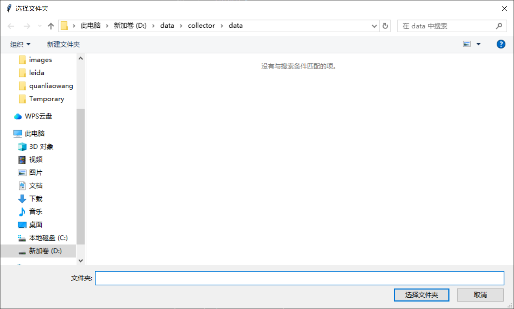
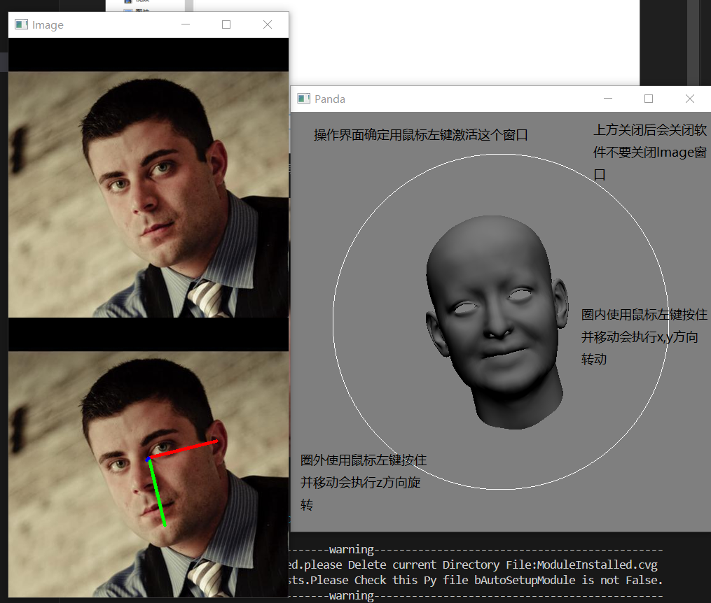
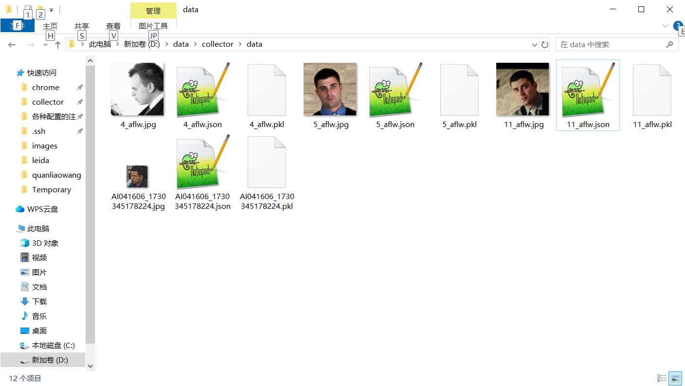
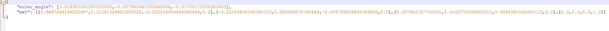

## Simple Head Pose Annotation Tool
### install method
pip install -r requirements.txt  
python ann3d.py  
**Note: This has only been tested on Windows 10 with Python version 3.12.7.**
### 使用方法

Select a folder containing .jpeg, .jpg, and .png files (other image types are currently not supported). Currently, all images must be head shots. Please crop the head shots as shown below: 
 
After selecting the folder, the software interface will look like this, with some operations also shown in the image below: 
 
Press the 'A' key to go to the previous image, and press the 'D' key to go to the next image. In the operation interface, holding down the left mouse button and dragging can change the model's orientation, which is previewed on the image. The operation interface includes a circle. Dragging the mouse inside the circle performs X/Y-axis rotation, while dragging outside the circle performs Z-axis rotation. Right-clicking resets the model. 
The contents of the folder after annotation are shown below: 
 
The folder will contain additional JSON files that can be used to view the output Euler angles and a 4x4 matrix, as shown below: 

