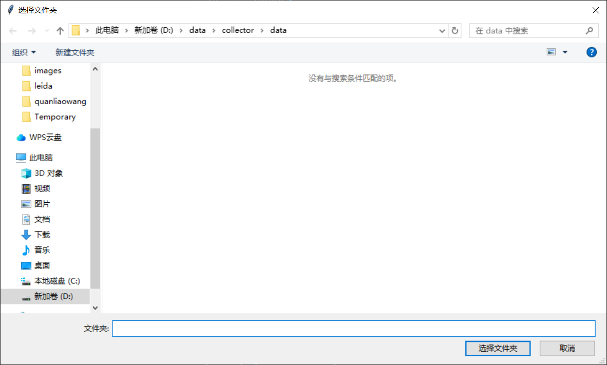
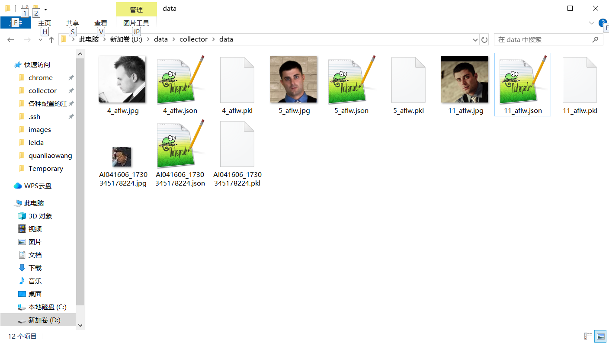

## 简单的headpose标注工具
### 安装方法
pip install -r requirements.txt  
python ann3d.py  
**注意只在win10下测试过,python版本3.12.7**
### 使用方法

选择带有.jpeg,.jpg,.png的文件夹(其余图片类型暂不支持),目前要求所有图片都是人头图片,请您裁剪好人头图片如下所示 
 
选中好后软件界面是这样的,其中部分操作也在下图显示 
 
按下键盘a键是上一张图片，按下键盘d键是下一张图片,在操作界面下鼠标左键按住并拖动可以更改模型朝向，同时可以在图片上预览出朝向,操作界面中有个圆，鼠标在圆内拖动执行x/y轴旋转,鼠标在圆外拖动执行z轴旋转,鼠标右键按下会重置模型。键盘delete可以删除这张图片的标注,并清空json的记录 
标注好后的文件夹内容如下所示: 
 
文件夹会多出json文件可以查看输出的欧拉角和一个4x4的矩阵,如下所示 

